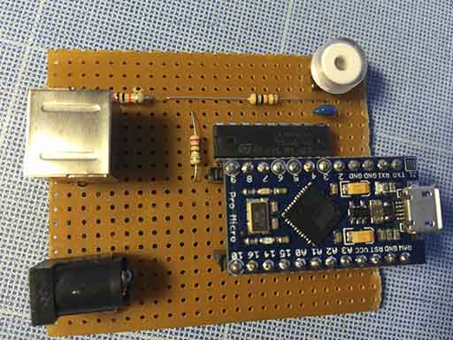

# FilterWheel
arduino micro based hardware and software to control an AFW1 filter wheel

# Usage

This project is depending on [LUFA](http://www.fourwalledcubicle.com/LUFA.php ) project, copy the file in the project/filter folder under the LUFA tree.
run make command. It will compile a firmware to upload to a Arduino Pro Micro. This binary needs to be uploaded using the programming port.

# Port mapping

The EFW1 filter wheel is piloted via 6 wires that needs to be attached to the arduino. Use a darlington arrays (ULN 2803) between the motor pins and the arduino

| Mini Din | Function | Description          |
| ----- | -------- | ----------- |
|  	   1   |   motor |  port 2 (PD1) via darlington |
|  	   2   |   motor |  port 3 (PD0) via darlington |
|  	   3   |   motor |  port 6 (PD7) via darlington |
|  	   4   |   motor |  port 4 (PD4) via darlington |
|  	   5   |    VCC  | 12V |
|  	   6   | position index |  Port 5 Be careful, return VCC, use it via tension divider |

